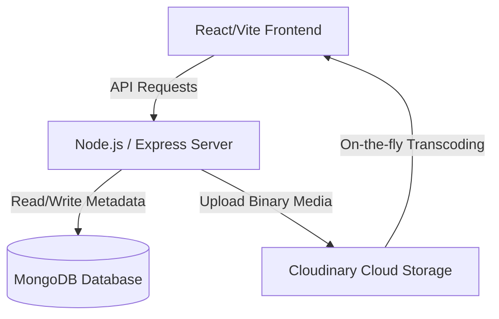

# Zootube 🎬
> A Premium Full-Stack Video Streaming & Social Engagement Platform

Zootube is a premium, feature-rich video sharing and social interactions application built on the MERN stack (MongoDB, Express, React, Node.js) and integrated with Cloudinary for fast on-the-fly media transcoding.

---

## 🚀 Key Features & Highlights

### 📺 1. Advanced Custom Video Player (`CustomVideoPlayer.jsx`)
Replacing generic browser media players, our player introduces high-end, responsive controls:
* **Cloudinary Dynamic Quality Adjuster**: Integrated on-the-fly quality shifting (1080p, 720p, 480p, 360p, Auto) by parsing media URLs and injecting auto-codec parameters (`vc_auto,q_auto:good,h_720,c_limit`) to ensure instant loading without upscale processing delays.
* **YouTube-Style Side-Sweeping Overlays**: Double-click or Arrow skips trigger left (`-5 SEC`) and right (`+5 SEC`) semi-circular sweeping cards containing sequence-animating chevrons.
* **Smooth Volume Scrolling**: Scrolling over the volume bar adjusts volume by `5%` increments and triggers a visual HUD overlay. Uses native `{ passive: false }` event binding to bypass browser scroll lagging.
* **Keyboard Hotkeys**: Support for key bindings:
  - `Space` (Play/Pause)
  - `M` (Mute/Unmute)
  - `F` (Fullscreen Toggle)
  - `ArrowLeft`/`ArrowRight` (Seek 5s rewind/forward)
  - `ArrowUp`/`ArrowDown` (Adjust volume by 5% with auto-unmute)
* **Double-Click Fullscreen**: Double-clicking inside the playing viewport toggles fullscreen mode.
* **Active Controls Persistence**: Auto-hide timeouts are paused during active seekbar dragging or when settings/playback menus are open.

### 🖼️ 2. Interactive Thumbnail Cropper & Editor (`ThumbnailEditor.jsx`)
* **16:9 Viewport Crop Box**: Locks aspect ratio for standard video presentation.
* **Reposition & Zoom**: Supports drag-to-pan (desktop and touch) and range scaling (`1x` to `3x`) with real-time percentage indicators.
* **Canvas-Based Export**: Generates a high-definition `1280x720` canvas crop and exports it as a standard Blob file, ensuring that the cropped selection is saved to the database.

### 📁 3. Live Video Upload Previews
* **Upload Dropzone Video Playback**: When a creator selects a video file for publishing, a live preview player is instantiated inside the dropzone using a secure local Object URL, complete with standard controls and a quick-remove (X) handler.
* **Text Contrast Fixes**: Input themes are configured with high-contrast classes (`text-zinc-900 dark:text-zinc-100`) to guarantee visibility in both light and dark modes.

### 💊 4. Grouped Like/Dislike Capsule
* **Unified State Management**: Backend database schema migrated to support unified Like/Dislike document records (using an `isDislike` field).
* **Glassmorphic Interactive Pill**: Renders a clean unified pill: `[ 👍 LikeCount | 👎 DislikeCount ]` with micro-scaling active click scale feedback animations and real-time count sync.

### 📝 5. Public Tweets Feed
* A dedicated micro-blogging tweets page displaying a chronological feed of all public posts, enabling likes, like counters, and restriction of editing/deletion rights to the respective creators.

### 📂 6. Inline Playlist Additions
* WATCH page includes inline playlist controls, permitting users to instantly create a new playlist and assign the video to it without page redirection.

---

## 🛠️ Tech Stack & Architecture



### Backend
* **Runtime**: Node.js & Express
* **Database**: MongoDB (using Mongoose ODM)
* **File Uploads**: Multer middleware (handling multipart forms)
* **Media Cloud Services**: Cloudinary (transcoding, image/video storage, dynamic URL-based resolution parameters)

### Frontend
* **Build tool**: Vite (React)
* **Styling**: Tailwind CSS & Vanilla CSS keyframe animations
* **Icons**: Lucide React
* **State & Forms**: React Hook Form, state refs, and native event handlers

---

## 📦 Third-Party Dependencies & Integrations

Our project leverages several industry-standard third-party services and open-source libraries:

### ☁️ Cloud Services & APIs
* **Cloudinary**: Handles cloud storage, compression, and real-time streaming optimizations for all uploaded video files, user avatars, cover images, and cropped thumbnails.

### ⚙️ Backend Libraries
* **Express**: Fast, minimalist web framework for Node.js routing.
* **Mongoose**: MongoDB object modeling tool designed to run in an asynchronous environment.
* **Mongoose Aggregate Paginate V2**: Query pagination extension to handle database-level video feeds.
* **Multer**: Node.js middleware for handling multipart/form-data, used for uploading video/image files to local temp cache.
* **JSON Web Tokens (jsonwebtoken)**: For issuing stateless authentication credentials and refresh tokens.
* **bcrypt**: Hashing library for encrypting user passwords.
* **cookie-parser**: Middleware to parse cookie headers for authentication guards.
* **cors**: Middleware to secure and enable cross-origin resource requests from the Vite frontend.
* **dotenv**: Loads environment variables from a `.env` file.

### 🎨 Frontend Libraries
* **React 19**: Core framework for building responsive component trees.
* **React Router DOM**: Declarative routing for page navigation.
* **Redux Toolkit & React Redux**: Core state container for global settings, session persistence, and user states.
* **Axios**: Promised-based HTTP client for calling backend routes.
* **React Hook Form**: Performance-optimized form state control and input validations.
* **Framer Motion**: Smooth interactive interface and slide sweep card animations.
* **Recharts**: D3-based charting library used to build the creator dashboard metrics.
* **Sonner**: Highly customizable toast notifications.
* **Lucide React**: Clean vector icon toolkit.
* **Tailwind CSS**: Utility-first CSS styling framework.

---

## 📂 Backend API Architecture (Highlights)

* **Users**: `/api/v1/users` (Registration, login, logout, refresh tokens, profiles, avatars, covers, watch history)
* **Videos**: `/api/v1/videos` (Publishing, fetch feed, update details, toggle visibility, delete videos)
* **Tweets**: `/api/v1/tweets` (Create, read public posts, update content, delete tweets)
* **Likes**: `/api/v1/likes` (Toggle like/dislike on videos, tweets, comments)
* **Playlists**: `/api/v1/playlists` (Create, update details, add/remove videos, user playlists feed)

---

## ⚙️ Project Installation & Setup

### Prerequisites
* Node.js (v18+)
* MongoDB instance (Local or Atlas URL URI)
* Cloudinary Developer Credentials (`cloud_name`, `api_key`, `api_secret`)

### 1. Clone & Configuration
Create a `.env` file in the backend root directory:
```env
PORT=8000
MONGODB_URI=mongodb+srv://<username>:<password>@cluster.mongodb.net/zootube
ACCESS_TOKEN_SECRET=your_access_token_secret
ACCESS_TOKEN_EXPIRY=1d
REFRESH_TOKEN_SECRET=your_refresh_token_secret
REFRESH_TOKEN_EXPIRY=10d

CLOUDINARY_CLOUD_NAME=your_cloudinary_name
CLOUDINARY_API_KEY=your_cloudinary_key
CLOUDINARY_API_SECRET=your_cloudinary_secret

CORS_ORIGIN=http://localhost:5173
```

### 2. Start Backend Server
```bash
# Navigate to project directory
npm install
npm run dev
```
*Server runs at `http://localhost:8000`*

### 3. Start Frontend Client
```bash
# Navigate to frontend folder
cd frontend
npm install
npm run dev
```
*Client runs at `http://localhost:5173`*
