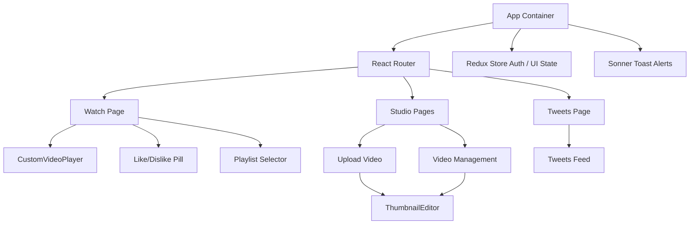

# Zootube Client 🎨
> Premium Frontend Interface for Zootube Video Platform

This is the React 19 + Vite frontend application for Zootube. It features a responsive layout, custom video streaming controls, an interactive local media cropper, and animated interactive elements.

---

## 🗺️ Frontend Component & Routing Architecture



---

## 📺 Feature Highlights (Frontend-Specific)

### 1. Custom Video Player (`CustomVideoPlayer.jsx`)
Replacing standard HTML5 controls, our player includes:
* **Quality Switcher Popover**: Seamlessly swaps video resolutions on-the-fly (1080p, 720p, 480p, 360p, Auto) by loading Cloudinary-optimized media streams. Keeps playback position synced via `"canplay"` event listeners without clamping issues.
* **Sweeping Seek Animations**: Renders Semispherical sweep indicators on double-tap or Arrow-key seek jumps, showing animated chevrons (`+5 SEC` / `-5 SEC`).
* **Scrolling Volume HUD**: Native wheel listener on the volume tracker with `{ passive: false }` for scroll-bar adjustments, displaying a central volume percentage overlay.
* **Shortcut Bindings**:
  - `Space` (Play/Pause)
  - `M` (Mute/Unmute toggle)
  - `F` (Fullscreen mode)
  - `ArrowLeft`/`ArrowRight` (Seek forward/back)
  - `ArrowUp`/`ArrowDown` (Volume adjustments)
* **Controls Persistence**: Auto-hide control overlays are paused when settings menus are active or while seeking.

### 🖼️ 2. Interactive Thumbnail Crop Editor (`ThumbnailEditor.jsx`)
Integrated into the upload dropzone and video edit modals, this component offers:
* **16:9 Aspect Ratio Mask**: Guarantees standard display proportions.
* **Responsive Canvas Exports**: Allows panning/repositioning and zooming (up to `3x`) on selected images, drawing adjustments to a `1280x720` canvas rendering context to export high-quality cropped Blobs.

### 📁 3. In-Browser Media Previews
* **Upload Player**: Instantiates local Object URLs (`URL.createObjectURL(file)`) for selected uploads to allow instant playback testing before publishing.

### 💊 4. Grouped Like/Dislike Pill
* Glassmorphic capsule supporting real-time likes/dislikes counts, click scaling animations, and auth-state checks.

---

## 🛠️ Tech Stack & Libraries

* **Framework**: React 19 (Functional components, hooks, custom refs)
* **Build Tool**: Vite (Optimized HMR configurations)
* **State Management**: Redux Toolkit & React Redux (for persistent user authentication and UI configurations)
* **Styling**: Tailwind CSS & custom Vanilla CSS keyframe animations
* **HTTP Client**: Axios (configured with credentials and base URL endpoints)
* **Forms**: React Hook Form (handling client-side validation and schema states)
* **Animations**: Framer Motion (page transitions and card list layout slides)
* **Notifications**: Sonner (crisp toast alerts)
* **Icons**: Lucide React (vector toolkit)
* **Charts**: Recharts (for dashboard analytics)

---

## ⚙️ Development Setup & Installation

### Prerequisites
* Node.js (v18+)
* Running backend Zootube Server at `http://localhost:8000` (refer to root README setup instructions)

### 1. Installation
Navigate into the `frontend` folder and install dependencies:
```bash
cd frontend
npm install
```

### 2. Running Dev Server
Start the Vite hot-reloading development server:
```bash
npm run dev
```
*Client will start running at `http://localhost:5173`*

### 3. Production Build
Generate a compiled production bundle:
```bash
npm run build
```
The output assets will be created in the `dist` directory.
